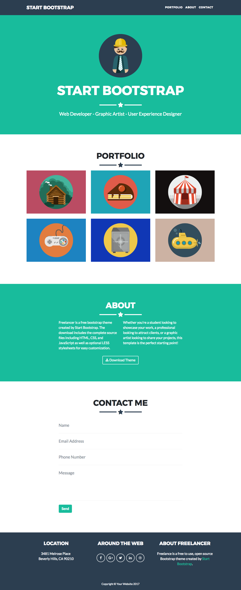

# Freelancer

Freelancer es un reto perteneciente a los ejercicios de [Gym](https://github.com/Laboratoria/gym/tree/DEV009) de Laboratoria. 

El reto consiste en replicar una maquetación dada con la técnica pixel perfect.

La interfaz objetivo es la siguiente.

El resultado final se puede consultar [aquí](https://freelancer-okmj.vercel.app/).

## Referencias
[Freelancer](https://github.com/Laboratoria/gym/tree/DEV009/exercises/freelancer-web)